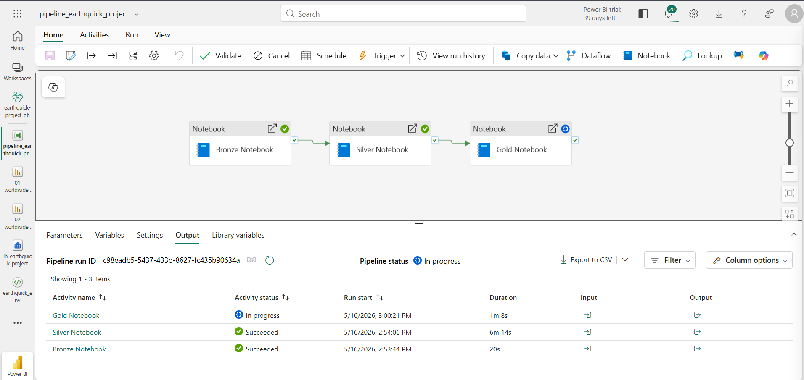

# Worldwide Earthquake Analysis - Microsoft Fabric

End-to-end data engineering pipeline that ingests live earthquake data from the USGS API and processes it through a **Medallion Architecture** (Bronze → Silver → Gold) on Microsoft Fabric.


## Architecture

```
USGS Earthquake API
        ↓
  Bronze Layer   →  Raw GeoJSON stored to Lakehouse Files
        ↓
  Silver Layer   →  Flattened & cleaned Spark table
        ↓
  Gold Layer     →  Enriched with country codes & significance class
        ↓
  Power BI       →  Interactive dashboards & maps
```

| Layer  | Input        | Output                       | Key Operation               |
|--------|-------------|------------------------------|-----------------------------|
| Bronze | USGS API     | `{date}_earthquake_data.json`| Data ingestion               |
| Silver | JSON file    | `earthquake_events_silver`   | Schema flattening & cleaning |
| Gold   | Silver table | `earthquake_events_gold`     | Reverse geocoding & enrichment |

#### Sample Pipeline




## Tech Stack

- **Platform:** Microsoft Fabric (Lakehouse, Spark, Power BI)
- **Language:** Python / PySpark
- **Data Source:** [USGS Earthquake Hazards API](https://earthquake.usgs.gov/fdsnws/event/1/)
- **Library:** `reverse-geocoder` (Gold layer)


## Quick Start

### 1. Setup

1. Create a Microsoft Fabric **Workspace**
2. Create a **Lakehouse** named `earthquake_data`
3. Import all three notebooks from the `notebook/` folder and attach the lakehouse

### 2. Install Dependencies

Run in the Gold layer notebook before first execution:

```python
%pip install reverse-geocoder
```

### 3. Run Notebooks in Order

```
01 Bronze  →  02 Silver  →  03 Gold
```

Set `start_date` and `end_date` consistently across all notebooks:

```python
start_date = "2024-01-01"
end_date   = "2024-01-07"
```

### 4. Visualize

Connect **Power BI** to the `earthquake_events_gold` semantic model in your workspace.


## Manual Testing Before Pipeline

Before wiring up the full end-to-end pipeline, validate each notebook manually in isolation.

### Use Dynamic Dates in Bronze

Replace hardcoded dates with a rolling window so every manual run fetches recent data:

```python
from datetime import date, timedelta

start_date = date.today() - timedelta(days=7)
end_date   = date.today() - timedelta(days=1)

print(f"{start_date}, {end_date}")

url = (
    "https://earthquake.usgs.gov/fdsnws/event/1/query?"
    f"format=geojson&starttime={start_date}&endtime={end_date}"
)
print(url)
```

### Inspect DataFrames

Add `display(df)` after any transformation to visually verify the output in Fabric's notebook UI:

```python
display(df)   # shows a paginated table — useful for spot-checking schema and values
```

### Checklist Before Building the Pipeline

- [ ] Bronze runs cleanly and the JSON file appears in `Files/`
- [ ] Silver reads the file and the table schema looks correct (`display(df)`)
- [ ] Gold table has `country_code` and `sig_class` columns populated
- [ ] Remove all `display()` calls and any hardcoded test dates
- [ ] Switch date variables back to pipeline parameters

> **Note:** When creating the Data Factory pipeline, use a `Set Variable` activity to test that parameter passing works before connecting the notebook activities.


## Project Structure

```
├── notebook/
│   ├── 01 ... Bronze Layer Processing.ipynb
│   ├── 02 ... Silver Layer Processing.ipynb
│   └── 03 ... Gold Layer Processing.ipynb
├── docs/screenshots/
├── FAQ.md
└── README.md
```


## Prerequisites

- Microsoft Fabric workspace with capacity access
- Basic Python / PySpark familiarity
- Internet access to the USGS API


## License

See [LICENSE](LICENSE).
